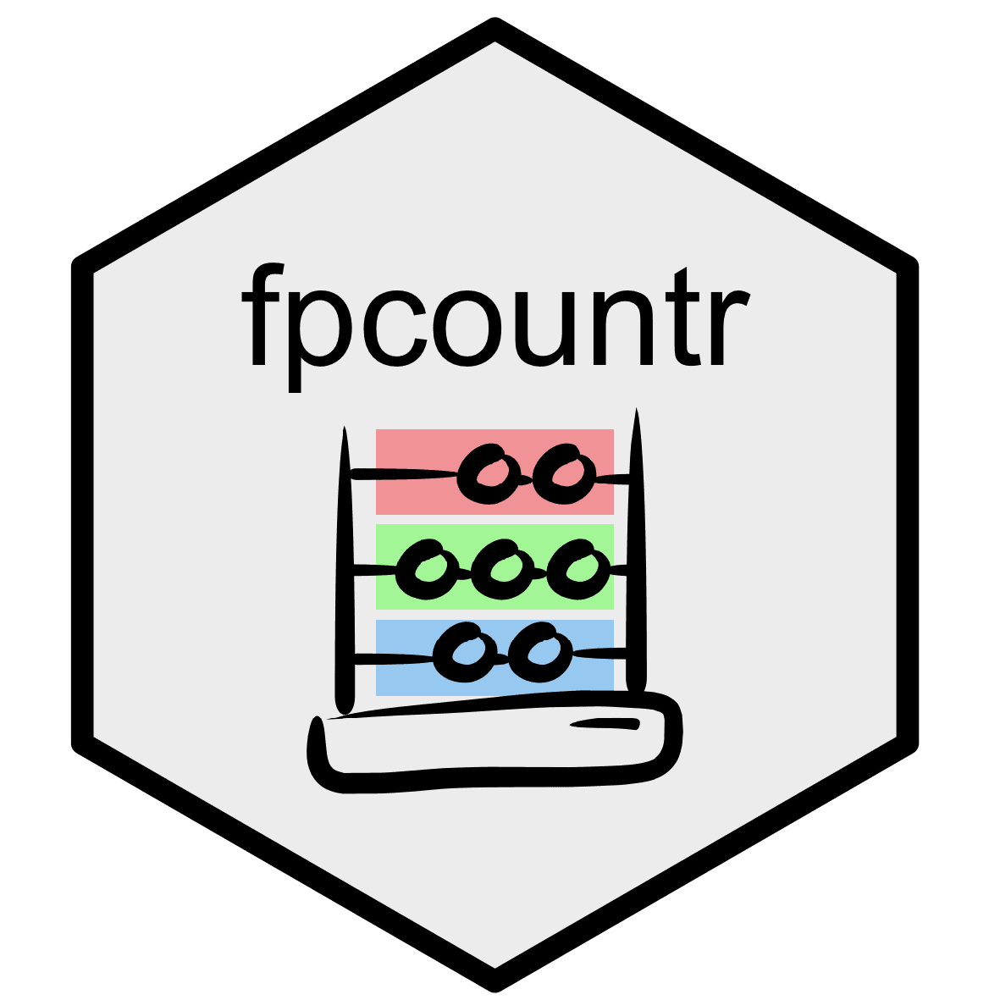

### 👩‍🔬 Welcome to the Csibra Lab GitHub Page

I am a Group Leader and Lecturer at the University of Leeds. My lab uses synthetic biology to understand and engineer bacterial cells for a range of applications. For those interested in our research: have a look at my [group](https://csibra-lab.com/) and [university](https://biologicalsciences.leeds.ac.uk/biological-sciences/staff/3562/dr-eszter-csibra) pages.

### 👩‍💻 Software for Synthetic Biology

Building software tools that improve the accuracy, reproducibility and automation of our data analysis workflows is central to our research. Our major contributions to date are: (1) in developing software that allows us to extract _real protein numbers_ from fluorescent protein assay data from plate readers: [FPCountR](https://github.com/ec363/fpcountr), and (2) in developing a web application that allows users new to programming to build their own data tidying function to convert any format of 'messy' exported data into 'tidy' data: [the Parsley app](https://github.com/ec363/parsleyapp).

### 📚 Resources for Everyone

In addition to software, we use GitHub to collate and share useful resources.

- 🔬 [Wet Lab Resources](https://github.com/ec363/wet_lab_resources) is a list of online resources on DNA part sequences, molecular biology questions or basic protocols for handling DNA/RNA/proteins and _E. coli_.
- 💻 [Coding Resources](https://github.com/ec363/coding_resources) is a list of resources helpful for learning to code, centred around the R language, but also including learning Git/GitHub for version control, and Markdown for text editing in coding-friendly formats.

### 🧬 Resources for Lab Members

New lab members [start here](https://github.com/ec363/csibra_lab_resources).
